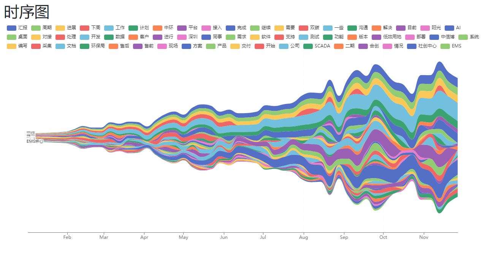
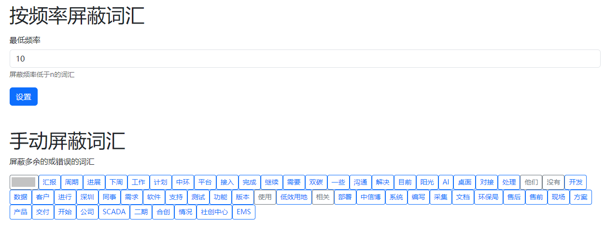

# 将工作周报转化为可视化图表

提取一段时间的工作周报内容，生成词云和河流图




可以直接过滤低频词汇，或手动操作删除某些虚词、连词等



# 使用说明

1. 下载本项目，不需要改变原本的目录结构
2. 在 /wr2data 文件夹中新建文件 ```dict.txt```，此文件是用户自定义词汇列表，每行一个单词即可。例如你的项目名称是```《医疗环境动力低碳AI区块链项目》```，为了使这个名称不被拆成多个词汇，需要将这个名称直接加入字典。
3. 运行 ```wr2data.py```, 输入周报文件夹的路径，程序获得周报的内容并且自动生成 ```/page/src/js/data.js```。（当前获取周报日期的方式是根据周报的名称截取字符串获取日期，定义在 ```getMon2Sun``` 方法中，请根据你周报实际日期记录方法修改这里。
4. 正确生成 ```data.js``` 后，在 /page 路径下执行```npm install```，安装前端环境。
5. 在 /page 路径下运行 ```npm run start```，之后访问```http://localhost:8080```，可以使用界面。

# 注意事项

+ 目前打开周报支持的格式为```.docx```，如果你的周报是```.doc```格式，可以下载```LibreOffice```，然后使用```/doc2docx.bat```转换，如果你的周报是其他格式，请自行修改程序中的```getContent```方法。